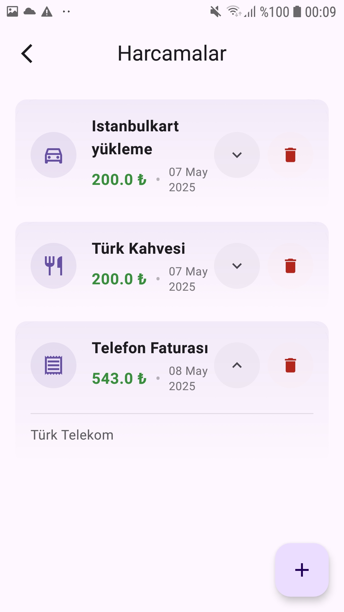
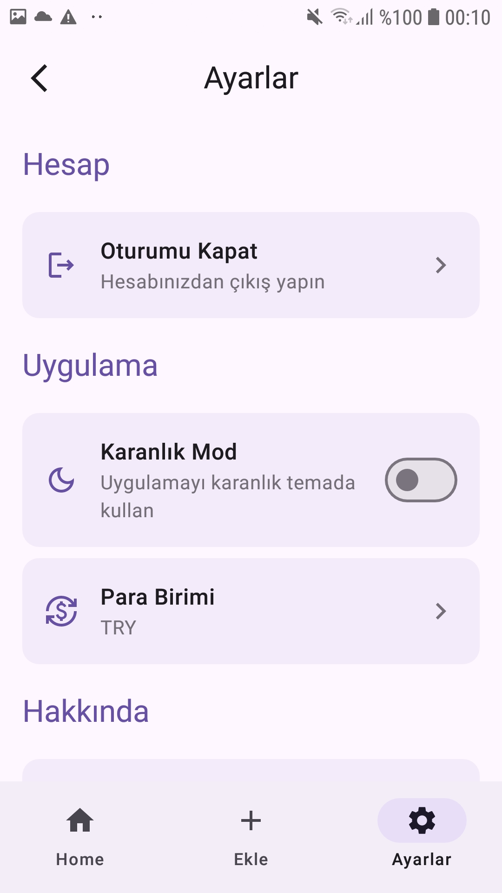
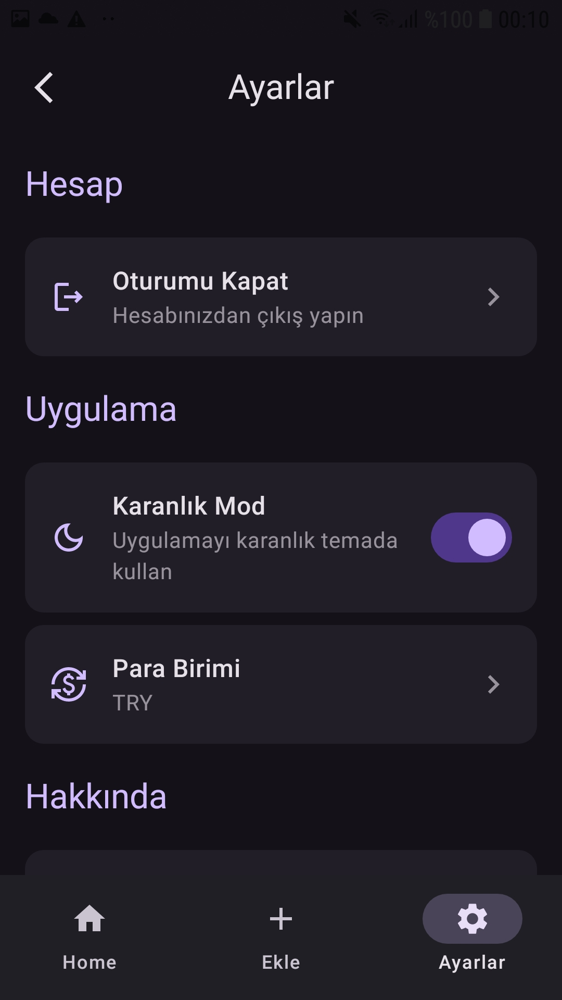

# Expense Tracker App

A modern expense tracking application built using Jetpack Compose and MVVM architecture. Users can sign up or log in, categorize their expenses, view daily totals, and track all their past expenses in a clean and responsive UI.

## 🧩 Features

- 🔐 User authentication with Firebase
- ➕ Add expenses with custom categories
- 📊 View daily total expenses instantly
- 📁 Access full list of all user-specific expenses
- 🔍 Organized and categorized display of expenses
- 🌙 Dark theme support (DataStore-based)
- 🔄 Real-time updates with Firebase Realtime Database

## 🛠 Technologies Used

- **Jetpack Compose**
- **MVVM Architecture**
- **Hilt (Dependency Injection)**
- **Kotlin Coroutines**
- **StateFlow**
- **Firebase Authentication**
- **Firebase Realtime Database**
- **Navigation Component**
- **Material 3 Design**
- **Dark Theme with DataStore**
- **Domain Layer with UseCases (Clean Architecture Approach)**
- **Lifecycle-aware Components (ViewModel, viewModelScope)**

## 📸 Screenshots

<table>
  <tr>
    <td></td>
    <td></td>
    <td></td>
  </tr>
  <tr>
    <td></td>
    <td></td>
  </tr>
</table>

> Built with ❤️ using modern Android technologies.
